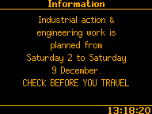

# FM28L Railway Departure Screen

  

An ongoing project to create a pixel-perfect software replica of the
[Infotec FM28L](https://www.infotec.co.uk/uploads/_products/product_1/FM28L-21541D-A.pdf) full-matrix LED passenger information display (and potentially other F-series displays) as seen at railway stations across the UK. The project also contains a GTK-based bitmap font editor tool, used for plotting fonts into the [custom binary format](font.h) used by the software.

## What does it do?
- Acts as a front-end/rendering engine for the FM28L LED matrix passenger information display, given the data to display is provided externally
- Recreates several screens including arrivals, platform next departure, and platform terminating train
- Renders to an internal 1-bit "LED" framebuffer, which is then re-rendered to the host framebuffer with chosen parameters to simulate LEDs
- Display size (in LEDs) can be changed in header files and the software will attempt to keep the layout reasonable

## What does it *not* do?
- Does not retrieve or process real railway data itself (see below)
- Does not feature any sound output. Station PA is an entirely separate system.
- Does not (yet) support grayscale pixels (all are on or off only)

Currently, **it does not actually retrieve any timetable/live running information**. All train running information is hard-coded filler text, as the main goal of the project is to replicate the display frontend (fonts/layouts/animations) - deciding what data you want to display is a separate matter.

Writing a program to "get train times" from the internet either by web scraping or using a simple API is trivial, but doesn't provide the level of detail and accuracy required by displays such as these. A long term goal is to implement a client for Darwin Push Port and other low level National/Network Rail data feeds in C to present accurate real-time data to the frontend. These are public versions of the same APIs the real display backends use, and while significantly more complex than a basic web API, allow for almost all the data present on real departure screens to be displayed in realtime.

## Potential use cases
- DIY replica displays for railway enthusiasts
- Realistic PIS for model railways or simulators
- Electronics education project - try to build a real LED matrix to run this on!
- Digital art installations
- Functional prop or realistic CGI for media/theatre use

## Screenshots
### Native Resolution Mode (192 x 144)
In this mode, one LED pixel in the display software's framebuffer becomes one pixel on screen - simple. This mode performs the best and is best suited to low resolution LCDs or real LED displays.

However, it usually doesn't look quite right. This is because the pixels used on the FM28L aren't square - the LEDs are laid out on the PCB with a slightly wider vertical spacing than horizontal. Therefore, this mode looks the best when used on a display with the correct pixel aspect ratio, generally around 6:7.

### LED Mode
 "LED Mode" draws 6 x 7 pixel images to the screen for each LED pixel, giving a more authentic LED look for displaying on high resolution LCDs. This mode has slightly worse performance.

*Note: only two examples shown below as video captures of this mode are much larger and more difficult to compress!*

# Disclaimer
*This project is not affiliated with, endorsed by, or authorized by Infotec Ltd. It is an independent work created by personal observation, photography, and video recordings of public customer-facing railway displays on public land.*

*All elements including fonts, layouts, graphics, and animations have been independently plotted/reverse-engineered. This project consists entirely of my own work and does not knowingly include any copyrighted material, proprietary information, or trade secrets belonging to Infotec Ltd.*

---

Copyright © Eddie Hart 2024. All rights reserved.